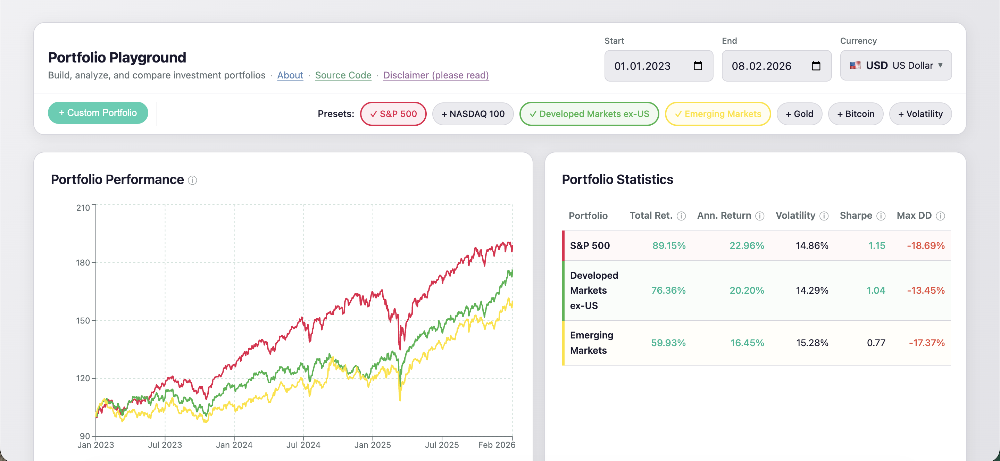
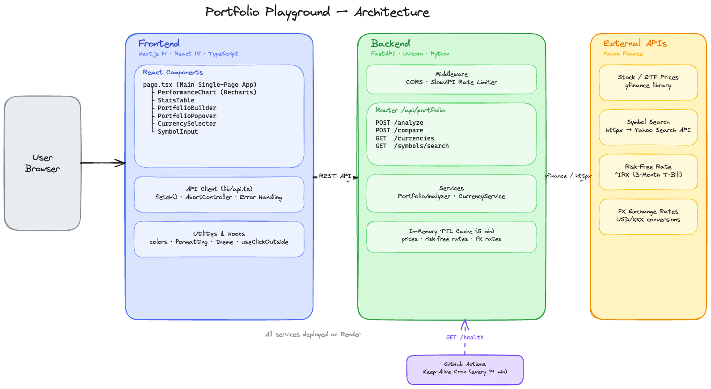

# Portfolio Playground

A web application for analyzing and comparing investment portfolio performance. Build custom portfolios from real market data, visualize historical returns, and compare key risk/return metrics side by side. See [this blog post](https://jianchao.xyz/posts/vibe-coding-portfolio-playground/) for an introduction and demo video.



## Features

- **Portfolio builder** -- Create custom portfolios by searching for ticker symbols and assigning weights. Includes autocomplete search powered by Yahoo Finance.
- **Preset portfolios** -- Quickly add common benchmarks: S&P 500 (VOO), NASDAQ 100 (QQQ), Developed Markets (VEA), Emerging Markets (VWO), Gold (GLD), Bitcoin (IBIT), and Volatility (VIXY).
- **Performance chart** -- Compare portfolios on a normalized $100-start line chart over a configurable date range.
- **Statistics table** -- Side-by-side comparison of Total Return, Annualized Return, Volatility, Sharpe Ratio, and Max Drawdown, with tooltips explaining each metric.
- **Multi-currency support** -- View results in 40 currencies (USD, EUR, GBP, JPY, CNY, and more) using real-time exchange rates.
- **Asset allocation view** -- Hover over any portfolio to see a pie chart breakdown of its holdings.

## Architecture



**Frontend** (`frontend/`) -- Next.js 14 with React 18 and TypeScript. The main single-page app (`page.tsx`) orchestrates several components:
- `PerformanceChart` (Recharts) -- Normalized line chart comparing portfolio performance
- `StatsTable` -- Side-by-side financial metrics comparison
- `PortfolioBuilder` / `PortfolioPopover` -- Portfolio construction and asset allocation views
- `CurrencySelector` / `SymbolInput` -- Currency picker and ticker autocomplete search

The API client (`lib/api.ts`) handles all backend communication with `fetch()`, `AbortController` for request cancellation, and error handling. Shared utilities include color schemes, formatting helpers, theme configuration, and custom hooks like `useClickOutside`.

**Backend** (`backend/`) -- FastAPI server running on Uvicorn with the following layers:
- *Middleware* -- CORS support and SlowAPI rate limiting
- *Router* (`/api/portfolio`) -- `POST /analyze`, `POST /compare`, `GET /currencies`, `GET /symbols/search`
- *Services* -- `PortfolioAnalyzer` computes returns and metrics; `CurrencyService` handles FX conversions
- *Cache* -- In-memory TTL cache (5 min) for prices, risk-free rates, and FX rates

**External APIs** (Yahoo Finance) -- The backend fetches data via:
- `yfinance` library -- Stock/ETF historical prices
- `httpx` -- Symbol search via Yahoo Search API
- `^IRX` ticker -- 3-month T-bill index for risk-free rate
- Currency pairs (e.g., `EURUSD=X`) -- Real-time FX rates

**Keep-Alive** -- A GitHub Actions cron job pings `GET /health` every 14 minutes to prevent Render free-tier cold starts.

## Getting Started

### Prerequisites

- Python 3.10+
- Node.js 18+
- pnpm

### Setup

```bash
# Install frontend dependencies
pnpm install

# Set up backend virtual environment
cd backend
python -m venv venv
source venv/bin/activate
pip install -r requirements.txt
cd ..
```

### Run

```bash
# Start both frontend and backend together
pnpm dev
```

Or run them separately:

```bash
# Backend (http://localhost:8000)
cd backend
./venv/bin/python -m uvicorn app.main:app --reload

# Frontend (http://localhost:3000)
cd frontend
npm run dev
```

- Frontend: http://localhost:3000
- Backend API: http://localhost:8000

## Deployment

The app is deployed using free tiers: frontend on **[Vercel](https://vercel.com)** and backend on **[Render](https://render.com)**. Free-tier limitations include:

- **Render cold starts** -- The backend spins down after inactivity. A GitHub Actions cron job pings the backend every 14 minutes to keep it alive.
- **512 MB memory** -- Render free tier has limited RAM, which constrains cache sizes and concurrent requests.

## Disclaimers

This project and the accompanying [webapp](https://portfolio-playground-frontend.vercel.app/) are for informational and educational purposes only. I am not a professional investor or financial advisor, nor do I claim to be, and use of this project or [webapp](https://portfolio-playground-frontend.vercel.app/) does not create an advisory relationship. Data may be inaccurate, delayed, or incomplete, and I do not accept responsibility for any such inaccuracies. The content reflects my personal research and understanding and should not be interpreted as professional advice. You are solely responsible for your financial decisions — consult a qualified financial professional before making investment decisions.

The [webapp](https://portfolio-playground-frontend.vercel.app/) is deployed using free tiers of [Render](https://render.com/) and [Vercel](https://vercel.com/), so its availability is not guaranteed.